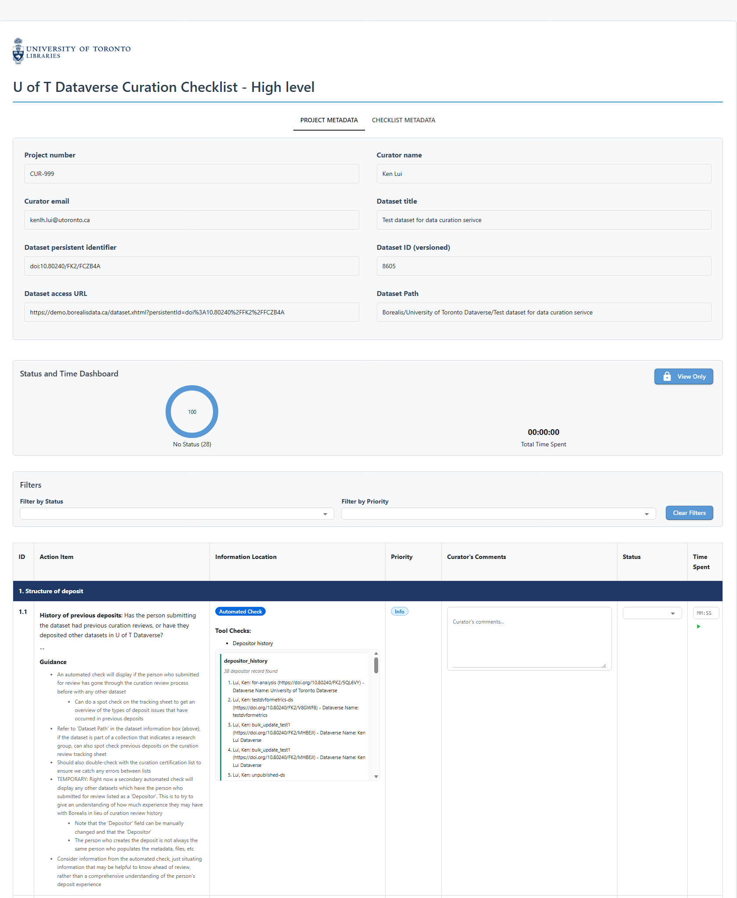
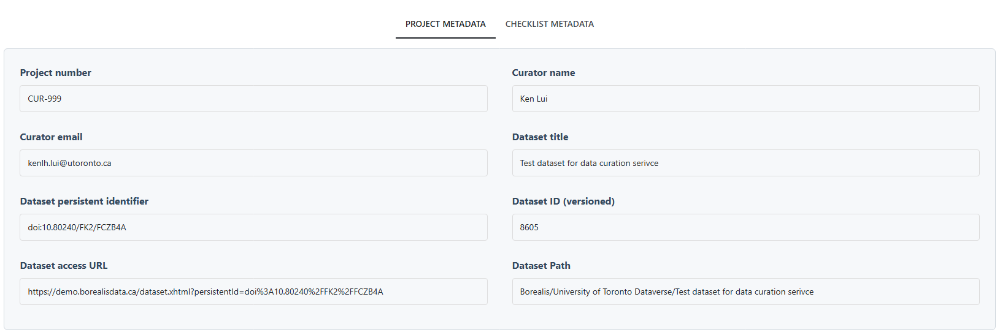
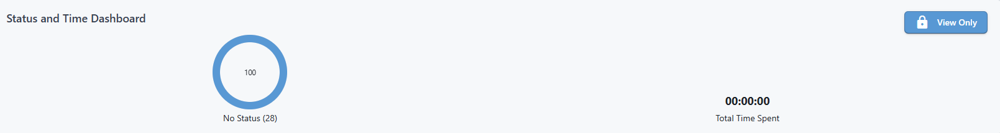
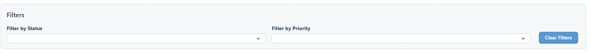
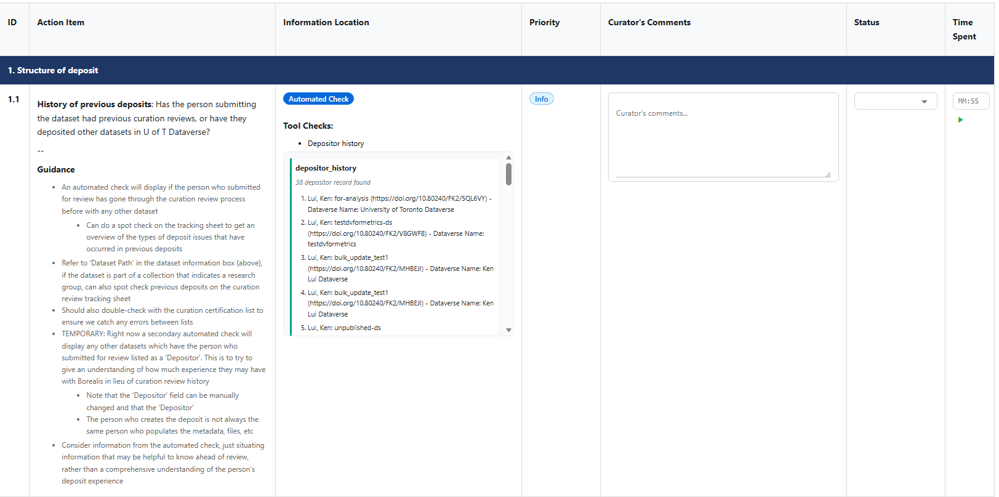
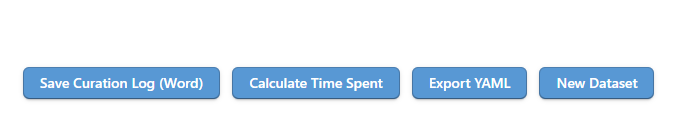

Checklist page
===

## Introduction
The Checklist page is the working area for the curation review. This is where curators will review the dataset and fill in the checklist information. The checklist is generated based on the dataset information you provided in the previous step, and also based on the automated checks performed by the tool.

Click the collapsible section below to expand and view the checklist page.

??? note "Screenshot of the checklist page"

    <figure markdown="span">
    { width="800" }<figcaption>Checklist page of the U of T Dataverse Curation Tool</figcaption>
    </figure>

## Feature overview

### Project metadata and checklist metadata tabs

<figure markdown="span">
{ width="1000" }<figcaption>Project metadata and checklist metadata tabs</figcaption>
</figure>

At the top of the page, you will see the project information (under the 'PROJECT METADATA' tab) such as project ID, dataset DOI, dataset title, etc. In the 'CHECKLIST METADATA' tab, you will find the the checklist metadata such as the checklist title, version, checklist curation, etc.

### Status and time spent dashboard

<figure markdown="span">
{ width="1000" }<figcaption>Status and time spent dashboard</figcaption>
</figure>

Next, below the project and checklist metadata, you will see the status and time spent dashboard. It shows the count of each status against the total number of checklist items, and the total time spent on the checklist.

The status and time spent dashboard is designed to give you a quick overview of the progress of your checklist review. 

The status count will update as you:
1. Update the 'Status' of each checklist item in the table
2. Update 'Time Spent' for each checklist item in the table, either by clicking the start/stop timer button or by manually inputting the time spent.

On the top right corner of the dashboard, there's a 'View Only' button, where you can toggle the page to a view-only mode, without the ability to edit the checklist.

### Filter

<figure markdown="span">
{ width="1000" }<figcaption>Filter section</figcaption>
</figure>

This is the  filter section, where you can filter the checklist items by the status and priority.

### Checklist table

<figure markdown="span">
{ width="1000" }<figcaption>Checklist table</figcaption>
</figure>

Finally, you will see the checklist table. Each row in the table is a checklist item. The columns in the table include:

1. **ID**: the ID of the checklist item.
2. **Action Item**: the description of the checklist item, which is structured below
      1. The leading item description: this is a concise description of the checklist item
      2. The guidance: this is a more detailed description of the checklist item, providing more context and guidance on how to review the item, such as what information to look for, and how to determine the status of the item.
3. **Information Location**: this section is divided into three parts:
      1. Check type: the badge indicating whether this check item is automated, semiautomatic, or manual.
      2. 'Tools check': If it's an automated or semiautomated check, the specific check that the tool performs for this item will be listed here. A box will follow with the check, showing what the check is and the result of the check if you have run it.
      3. 'Curator Check' information, where is a prompt that tells you what information to look.
4. **Priority**: the priority level for the checklist item, mostly for indicating the level of communication needed with the data depositor to resolve the item. The level of priority is described below:
      1. Info: this indicates that the checklist item is for information only. It's more for contextual information, and (usually) does not require action from the curator.
      2. Required: this indicates that the checklist item is required. It means that if the item is with 'follow-up' status at the end of the review, the dataset will not be able to be published. The curator will need to follow up with the data depositor to resolve the item.
      3. Recommended: this indicates that the checklist item is recommended. It means that if the item is with 'follow-up' status at the end of the review, the dataset can still be published, but it's recommended to follow up with the data depositor to resolve the item. This depends on how many items are with 'follow-up' status, to avoid overwhelming the data depositor with too many follow-up items.
5. **Status**: the status of the checklist item, which can be the following:
      1. Pass: the item has passed the review.
      2. Follow-up: the item requires follow-up with the data depositor.
      3. TBD: to be determined, which means that the curator is not sure about the status of the item, and may need to consult with other curators or the data depositor
      4. Not Applicable: this usually applies to items with 'Info' priority, which means that the item is not applicable to the dataset, and can be marked as 'Not Applicable' without follow-up.
6. **Comments**: the comments for the checklist item. You can fill in the comments with any notes or thoughts you have about the item during the review, such as what information you found for the item, and why you determine the status of the item.
7. **Time Spent**: the time spent on the checklist item. You can log the time spent on each item in the checklist. Click the start `▶︎` button to start the timer when you begin working on an item, and click the stop `■` button when you finish. The time will be logged in this column. If you forget to start the timer, you can also manually input the time spent in this column in the format of MM:SS (e.g. 15:30 for 15 minutes and 30 seconds).

### Checklist buttons

<figure markdown="span">
{ width="1000" }<figcaption>Checklist buttons</figcaption>
</figure>

At the bottom of the checklist table, there are four buttons:

1. **Save Curation Log (Word)**: this button will save the curation log in a Word document format. The curation log includes the checklist table with all the information you have filled in.
2. **Calculate Time Spent**: this button will calculate the total time spent on the checklist based on the time logged for each item. A notification will pop up to show the total time spent.
3. **Export YAML**: this button will export the checklist table in a YAML format.
4. **New Dataset**: this button will take you back to the landing page.