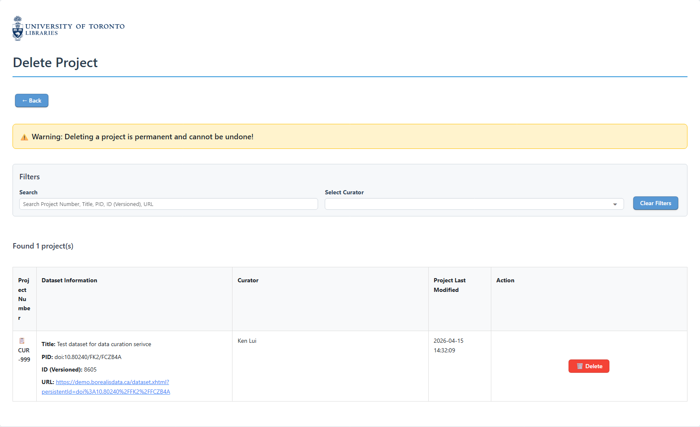

Delete Project page
===

<figure markdown="span">
  { width="800" }<figcaption>Delete Project page of the U of T Dataverse Curation Tool</figcaption>
</figure>

This is the page for deleting a project.

# Navigation
Click the '← Back' to return to the landing page.

# Filtering Projects
You can use the filter section to search for the project you want to delete, by:

1. Using the search box to search for the project by the Project Number, Dataset DOI, or Dataset Title.
2. Filtering the curator by selecting the curator name from the dropdown menu.

# Project table
The project table lists all the curation projects. 

!!! warning
    Deleting a project is irreversible. Pleas make you sure you know which project you are deleting.

You can click on the '🗑️ Delete' button to delete project. This will delete the database records in the tool's database, and also all the downloaded dataset metadata and data files.