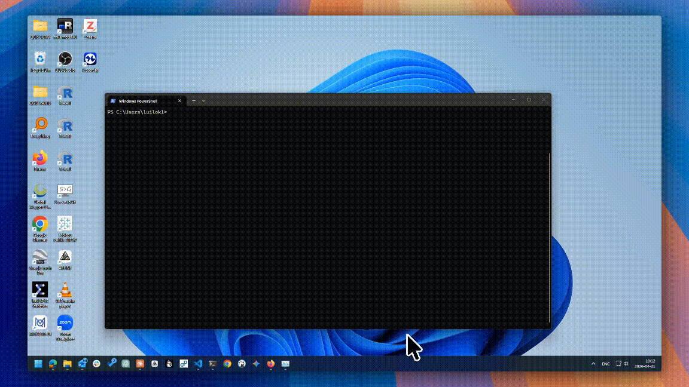
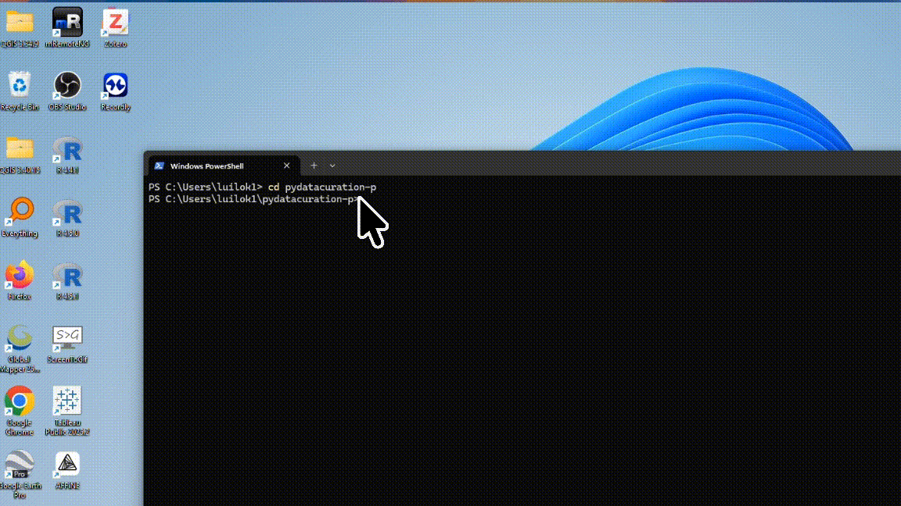

Restart instructions
===


To restart the U of T Dataverse Curation Tool on a Windows local machine, follow the steps below:

# Steps
1. Open a PowerShell terminal.
      
      { width="800" }

2. Type (or copy and paste) the following command to change your terminal's directory to the *pydatacuration-p* folder:
   ```powershell
   cd pydatacuration-p
   ```

      { width="800" }

3. Once you are in the *pydatacuration-p* folder, you can run the following command to update the tool to the latest version:
      ```powershell
      git switch main ; git pull
      ```

4. Run the following command in the PowerShell terminal to start VS Code in the current directory:
   ```powershell
   code .
   ```

      { width="800" }

5. Open the `.env` file in VS Code using the left panel. Change the value of `API_TOKEN` to your latest API token, especially if you have revoked or generated a new one. Also change the `CURATOR_NAME` and `CURATOR_EMAIL` if necessary.

      { width="800" }

6. Finally, run the application in the PowerShell terminal using the following command:
   ```powershell
   uv run --env-file .env app.py
   ```

      { width="800" }

      You should be able to access the tool at http://localhost:9005 in your web browser.

# Close the application
To close the application, simply press `Ctrl + C` in the PowerShell terminal.

!!! danger "API Token security tip"

    A best security practice is revoke the API Token in Borealis after you are done using the tool. You can generate a new API token for the next time you use the tool.

