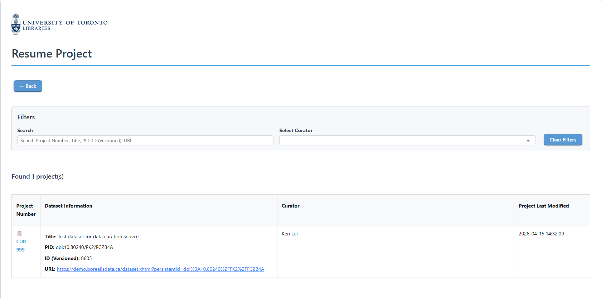

Resume Project page
===

<figure markdown="span">
  { width="800" }<figcaption>Resume Project page of the U of T Dataverse Curation Tool</figcaption>
</figure>

This is the page for resuming a project.

Click the '← Back' to return to the landing page.

You can use the filter section to search for the project you want to resume, by:

1. Using the search box to search for the project by the Project Number, Dataset DOI, or Dataset Title.
2. Filtering the curator by selecting the curator name from the dropdown menu.

# Project table
The project table lists all the curation projects.

